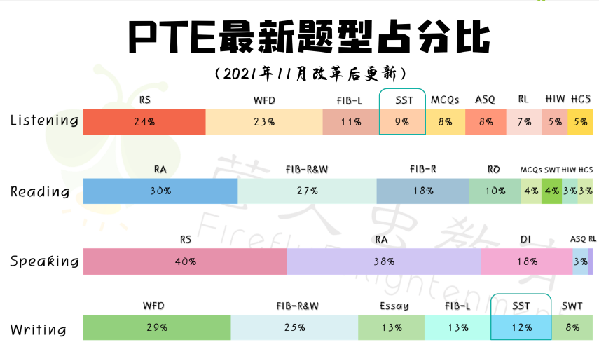
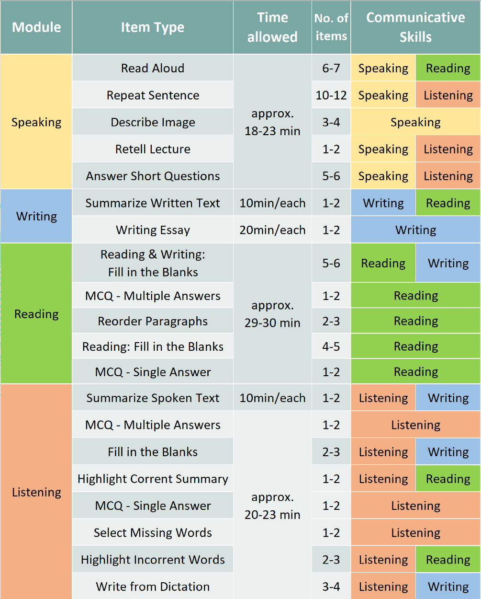

# PTE刷题笔记

## 重要必刷题型
### RS, WFD, RA, RO, DI, SST, FIB-R&W, Essay, FIB-L, FIB-R
- Listening: RS, WFD
- Reading: RA, FIB-R&W, FIB-R, RO
- Speaking: RS, RA, DI
- Writing: WFD, FIB-R&W, Essay, FIB-L, SST

## 各题型刷题方法

所有出现不会单词都要记录单词本积累

### WFD

一共200题 刷完 要求达到可以每一题听写默写 每天20-50题 刷3遍

### ASQ

一共600题 刷完 要求可以听懂并答对每一题 不会题要过三遍

### DI & RL 需要交作业

模板训练，熟背模板，根据模板每天刷x题 2-3题 直到老师觉得熟悉

### RA 需要交作业

老师推荐一句话模式，每天刷x题 精练确保每一道刷过的题都能流畅，每个单词都保证会读 一组（6-7个）交作业的时候交一句话，之后精读读整篇（练熟之后也要交）

### SST 

SST的关键在于质量而不是数量，所以模板套的关键词越多越好，机经命中率高
写的时候不能分行，要写成一个自然段
使用模板是填充的单词必须是名词词性
不够15词时，重复使用
一共48题 尽量全部刷完 考到的时候能听出来，并背下来关键词 近似音频要多听几遍 2-5个

### RS

多练，保证流利度的情况下尽可能复述更多的内容，说出80%的内容可以拿满分，50%的内容可以拿2/3分 1-2组（10-20个）

### FIB-L & HIW

目前还没练过，之前没有报班的时候基本一题错一个空

### 阅读 RO
时转代同
- 时间关键词: 必须是绝对时间; 并且内容主题一致 
- 转折词: 要在句首才有效
参加阅读刷题班 1-3，拖拽下拉每天3个

### 大作文

考前30个topic全部过完，每天1题

## 题型占分百分比

